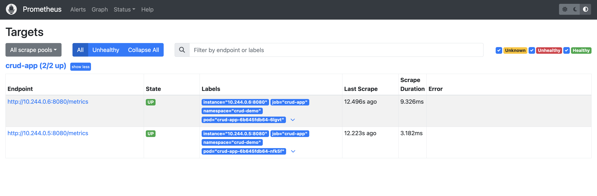
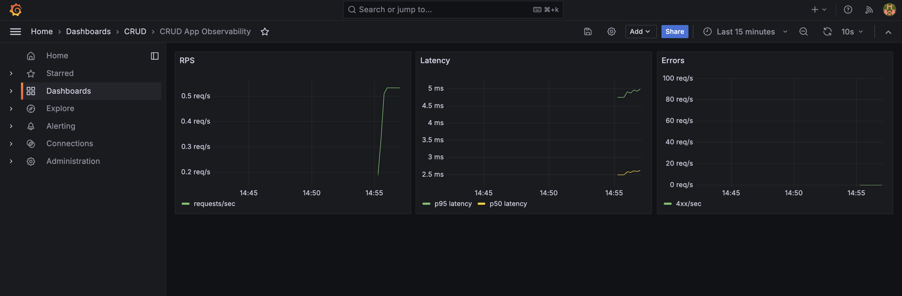

# CRUD App Observability в Kubernetes

Решение варианта 1: приложение разворачивается в локальном kind-кластере, Prometheus и Grafana устанавливаются через raw Kubernetes-манифесты с помощью `kubectl apply`.

## Структура

```text
app/
  main.go
  Dockerfile
k8s/
  kind-config.yaml
  namespace.yaml
  postgres.yaml
  app.yaml
  monitoring/
    namespace.yaml
    prometheus-config.yaml
    prometheus.yaml
    grafana.yaml
    grafana-dashboard.json
```

## Запуск

### 1. Создать kind-кластер

```bash
kind create cluster --name demo --config k8s/kind-config.yaml
```

`kind-config.yaml` пробрасывает:

- приложение: `http://localhost:8080`;
- Prometheus: `http://localhost:9090`;
- Grafana: `http://localhost:3000`.

### 2. Собрать и загрузить образ приложения

```bash
cd app
go mod tidy
docker build -t crud-app:latest .
kind load docker-image crud-app:latest --name demo
cd ..
```

### 3. Развернуть CRUD-приложение

```bash
kubectl apply -f k8s/namespace.yaml
kubectl apply -f k8s/postgres.yaml
kubectl apply -f k8s/app.yaml

kubectl rollout status deployment/postgres -n crud-demo
kubectl rollout status deployment/crud-app -n crud-demo
```

Проверка:

```bash
curl http://localhost:8080/health
curl http://localhost:8080/metrics
```

### 4. Развернуть Prometheus и Grafana

```bash
kubectl apply -f k8s/monitoring/namespace.yaml
kubectl apply -f k8s/monitoring/prometheus-config.yaml
kubectl apply -f k8s/monitoring/prometheus.yaml
kubectl apply -f k8s/monitoring/grafana.yaml

kubectl rollout status deployment/prometheus -n monitoring
kubectl rollout status deployment/grafana -n monitoring
```

Prometheus UI:

```text
http://localhost:9090
```

Grafana UI:

```text
http://localhost:3000
```

Логин/пароль Grafana:

```text
admin / admin
```

Dashboard находится в папке `CRUD` и называется `CRUD App Observability`.

### 5. Сгенерировать трафик

```bash
BASE=http://localhost:8080

curl -s -X POST "$BASE/users" \
  -H 'Content-Type: application/json' \
  -d '{"name":"Alice","email":"alice@example.com"}'

for i in $(seq 1 30); do
  curl -s "$BASE/users" >/dev/null
  curl -s "$BASE/users/1" >/dev/null
  curl -s "$BASE/users/999" >/dev/null
done
```

После этого в Prometheus появятся метрики `crud_http_requests_total` и `crud_http_request_duration_seconds_bucket`, а в Grafana начнут заполняться панели.

## Скриншоты

### Prometheus Targets

Prometheus автоматически обнаружил pod-ы приложения по label `app=crud-app` через `kubernetes_sd_configs`. Target приложения находится в состоянии `UP`, значит метрики с `/metrics` успешно собираются.



### Grafana Dashboard

Grafana подключена к Prometheus как datasource. Dashboard `CRUD App Observability` содержит панели RPS, Latency и Errors с данными приложения.



## Полезные команды

```bash
kubectl get pods -n crud-demo
kubectl get pods -n monitoring
kubectl logs -l app=crud-app -n crud-demo -f
kubectl logs -l app=prometheus -n monitoring -f
kubectl logs -l app=grafana -n monitoring -f
kind delete cluster --name demo
```
